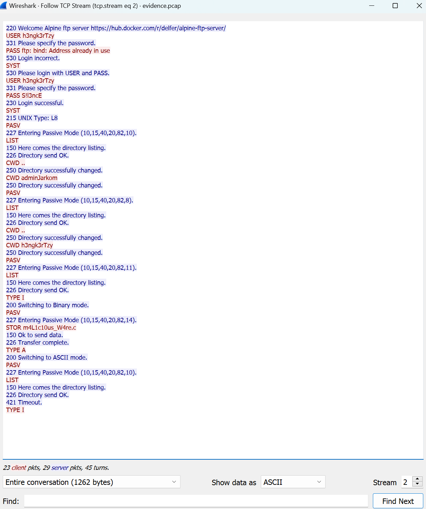
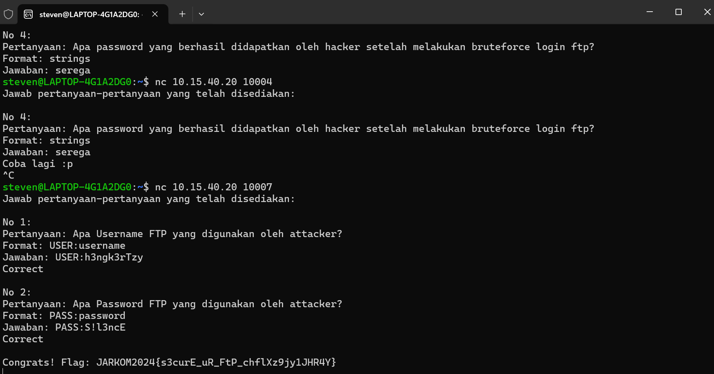
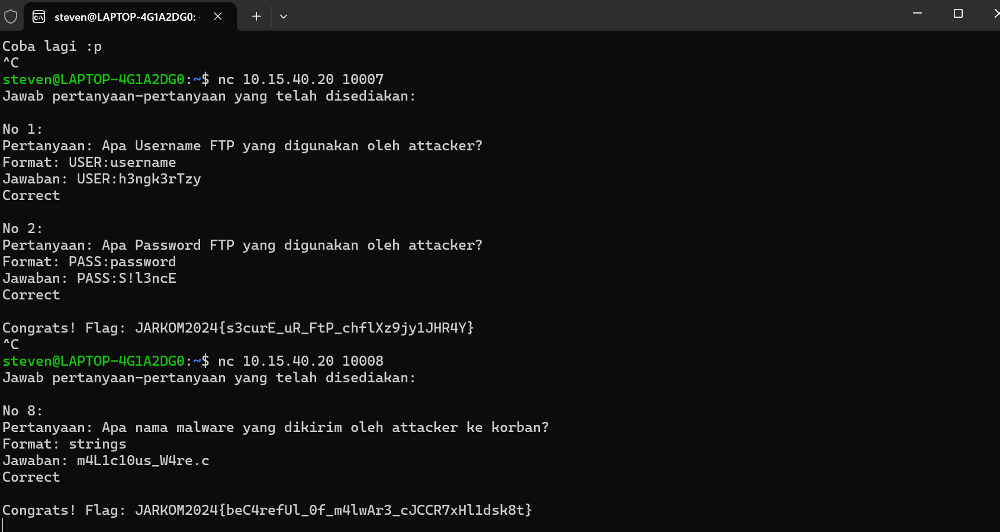
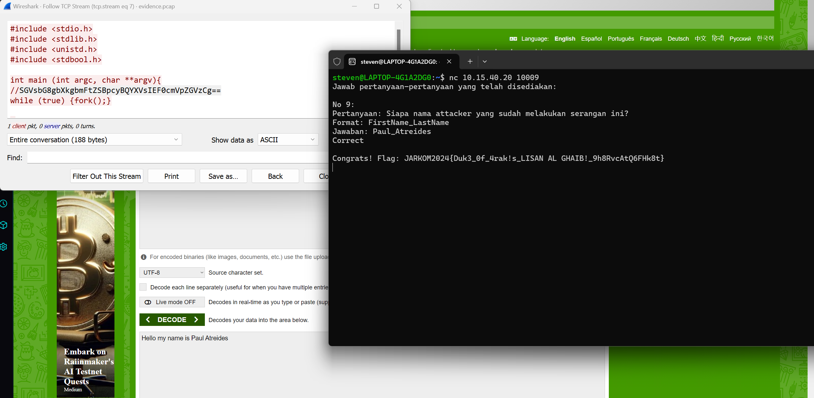
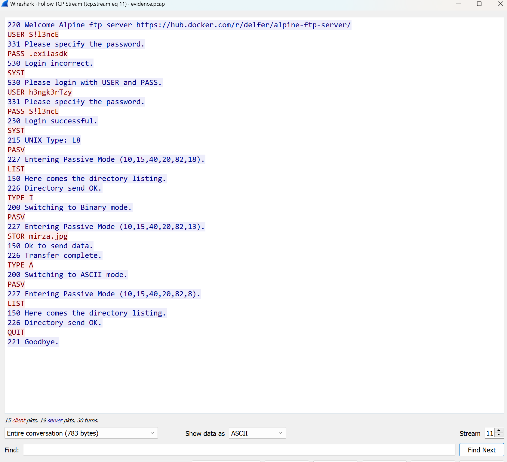
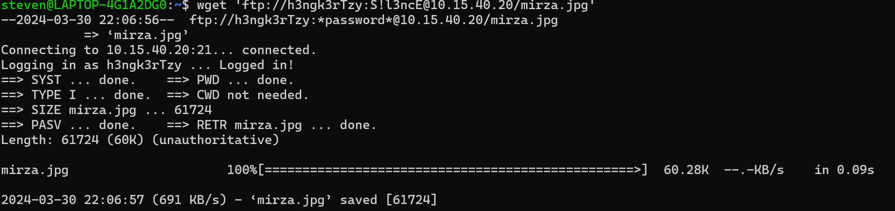
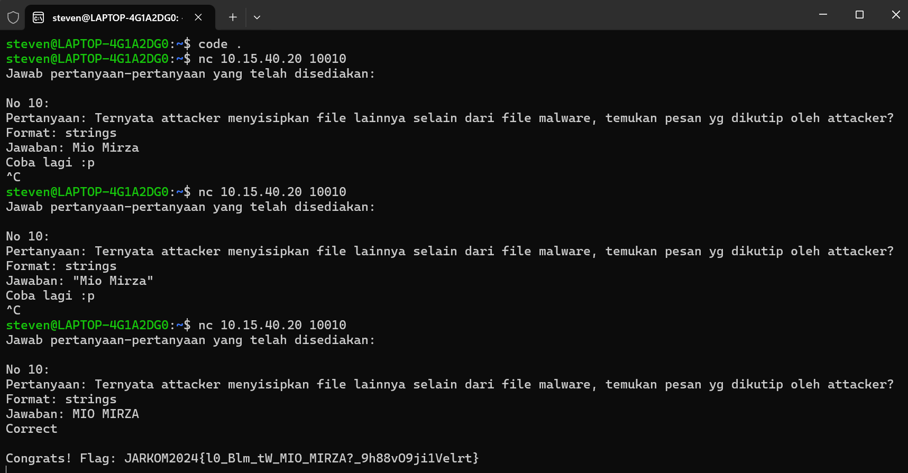

# Jarkom-Modul-1-IT16-2024
 
## Anggota Kelompok

| NRP        | Nama                    |
|:----------:|:-----------------------:|
| 5027221020 | Wikri Cahya Syahrila    |
| 5027221021 | Steven Figo             |

## 1 creds
pertama soal meminta mencari credentials dari ftp server sehingga dicari melalui follow TCP Stream

lalu menjawab pertanyaan username dan password untuk memperoleh flag

flag `JARKOM2024{s3curE_uR_FtP_cJwRYc9HiRFeR49}`

## 2 malwleowleo
diminta untuk mencari apa file malware yang dikirim 

ketemua file sus berupa `m4L1c10us_W4re.c`

flag `JARKOM2024{beC4refUl_0f_m4lwAr3_IhfkRzAfgRdHC8Y}`

## 3 whoami
diminta untuk mencari nama asli dari penyerang

ketemua isi dari file sus, lalu isi dari file harus di decode menggunakan base64 mendapat nama penyerangnya Paul Atreides

flag `JARKOM2024{Duk3_0f_4rak!s_LISAN AL GHAIB!_9JwlYbnyyAJtCAB}`

## 4 secret
diminta untuk mencari pesan rahasia dari penyerang
pertama mencari file lain yang dikirim ketemu `mirza.jpg`

lalu download filenya menggunakan  wget

setelah itu periksa gambar melalui vsc

ketemu pesan rahasianya `MIO MIRZA`

flag `JARKOM2024{l0_Blm_tW_MIO_MIRZA?_9h88vO9ji1Velrt}`
