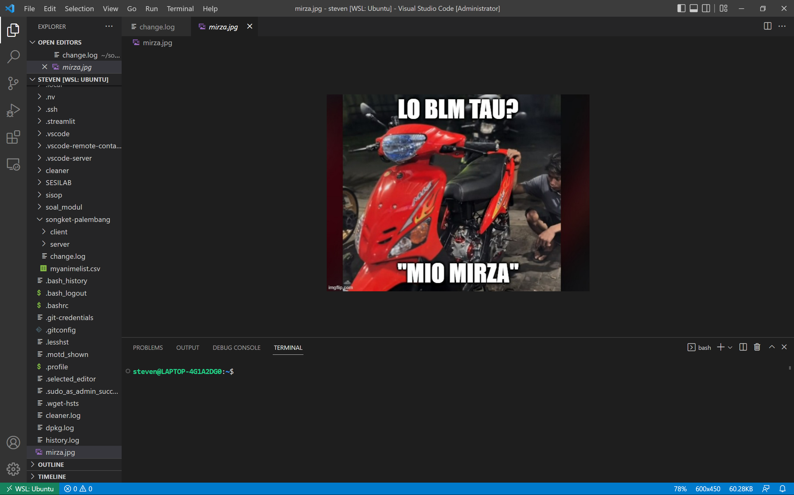

# Jarkom-Modul-1-IT16-2024
 
## Anggota Kelompok

| NRP        | Nama                    |
|:----------:|:-----------------------:|
| 5027221020 | Wikri Cahya Syahrila    |
| 5027221021 | Steven Figo             |

## 1 creds
pertama soal meminta mencari credentials dari ftp server sehingga dicari melalui follow TCP Stream

lalu menjawab pertanyaan username dan password untuk memperoleh flag

flag `JARKOM2024{s3curE_uR_FtP_cJwRYc9HiRFeR49}`

## 2 malwleowleo
diminta untuk mencari apa file malware yang dikirim 

ketemua file sus berupa `m4L1c10us_W4re.c`

flag `JARKOM2024{beC4refUl_0f_m4lwAr3_IhfkRzAfgRdHC8Y}`

## 3 whoami
diminta untuk mencari nama asli dari penyerang

ketemua isi dari file sus, lalu isi dari file harus di decode menggunakan base64 mendapat nama penyerangnya Paul Atreides

flag `JARKOM2024{Duk3_0f_4rak!s_LISAN AL GHAIB!_9JwlYbnyyAJtCAB}`

## 4 secret
diminta untuk mencari pesan rahasia dari penyerang
pertama mencari file lain yang dikirim ketemu `mirza.jpg`

lalu download filenya menggunakan  wget

setelah itu periksa gambar melalui vsc

ketemu pesan rahasianya `MIO MIRZA`

flag `JARKOM2024{l0_Blm_tW_MIO_MIRZA?_9h88vO9ji1Velrt}`

## 5 ATM or ATP or FTP
Soal disuruh mencari password yang berhasil digunakan oleh seseorang yang mencoba bruteforce login
Cara pengerjaan
1. Gunakan filter pada wireshark, disini kami menggunakan frame contains "Login", tapi disini karena masih banyak line dan packet yang tidak sesuai, kami gunakan filter frame contains "Login successful" kemudian muncul seperti di gambar
2. Lalu klik follow, kemudian muncul password yang berhasil digunakan
3. Masukkan password tadi ke pertanyaannya sehingga keluar flag yang diinginkan

## 6 Trace Him
Soal disuruh mencari IP Address yang digunakan oleh penyerang
Cara pengerjaan
1. Sesuai dengan soal yang tadi, lihat saja di bagian source dan destination tergantung dari info packetnya
2. Kemudian ketemu IP Addressnya
3. Masukkan ip address ke dalam terminal soal sehingga ketemu flag yang diinginkan

## 7 How many packets
Soal disuruh mencari berapa kali attacker mencoba login
Cara pengerjaan
1. Gunakan filter frame contains "Login incorrect"
2. Lalu muncul displayed total 933 + 1 login yang berhasil sehingga totalnya 934

## 8 Evidence
Di evidence berisi rangkaian soal
1. Domain milik korban
2. Web server yang digunakan
3. Endpoint untuk login
4. Email dan password yang digunakan

Cara pengerjaan
1. Untuk mencari domain saya menggunakan filter HTTP saja, kemudian saya klik salah satu dan follow sehingga muncul gambar seperti ini dan ketemu domain yang digunakan
2. Karena itu 1 paket, maka otomatis web server juga ketemu
3. Untuk soal 3 dan 4 kami menggunakan frame contains "Login successful" sehingga lebih mudah pencarian, kemudian saya follow sehingga ketemu endpoint dan email password yang digunakan oleh user biasa.

## 9 Fuzz
Di Fuzz juga berisi rangkaian soal
1. Mencari IP address milik attacker
2. Port yang digunakan sebagai web server korban
3. Endpoint yang digunakan
4. Tool yang digunakan oleh attacker untuk bruteforce login
5. Username dan password yang berhasil digunakan waktu bruteforce login

Cara pengerjaan
1. Gunakan filter http, kemudian saya sort dari atas ke bawah sehingga ada suatu packeet yang mencurigakan, kemudian dari situ terlihat IP source milik attacker dan port web server milik korban
2. Gunakan filter "login" untuk mencari login attempt lalu sort dari atas ke bawah sehingga ada 1 packet yang infonya 302 found
3. Follow paket tersebut lalu disini awalnya saya mencari keyword login success tapi tidak ketemu
4. Setelah tidak ketemu saya mencari filter 302 sehingga ketemu username dan password yang digunakan
